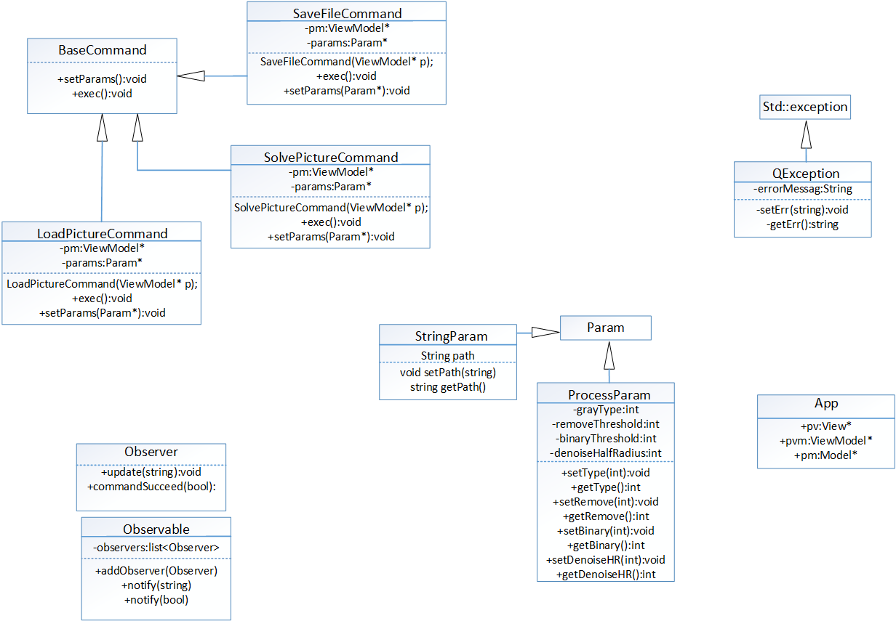
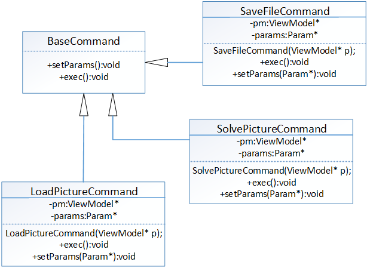
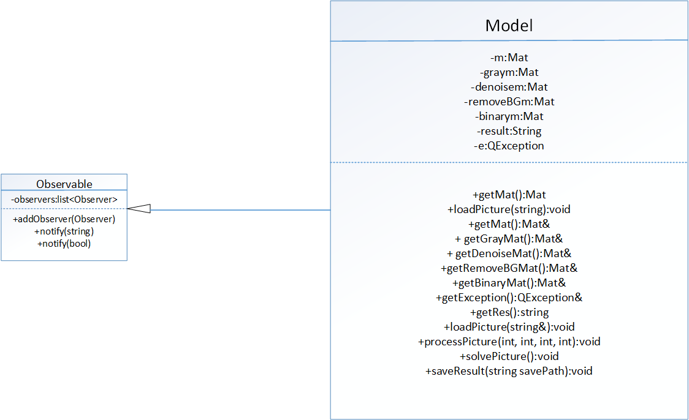
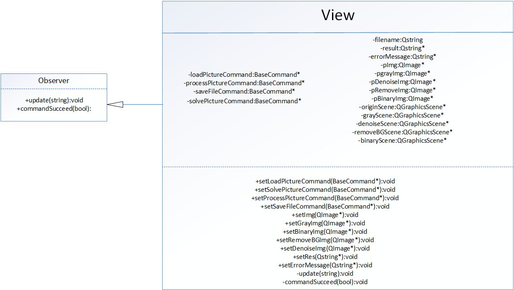
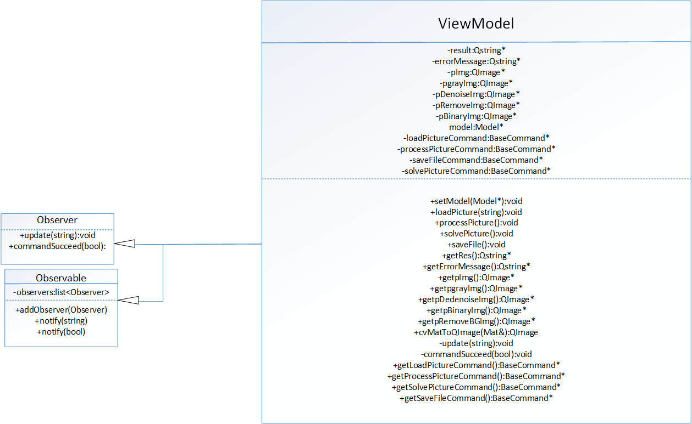
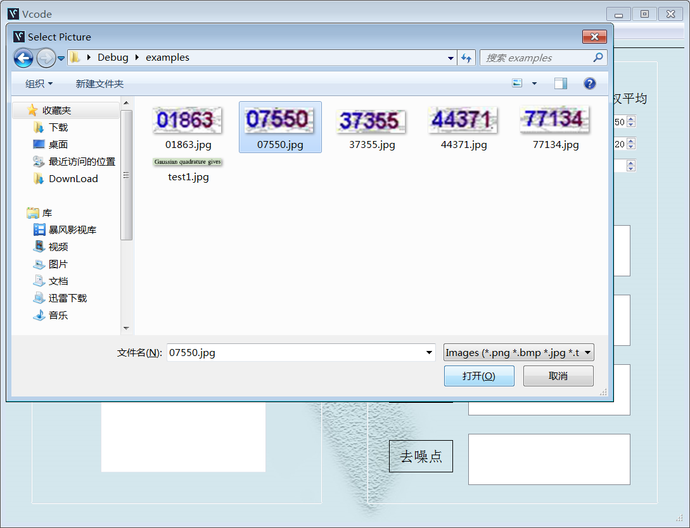
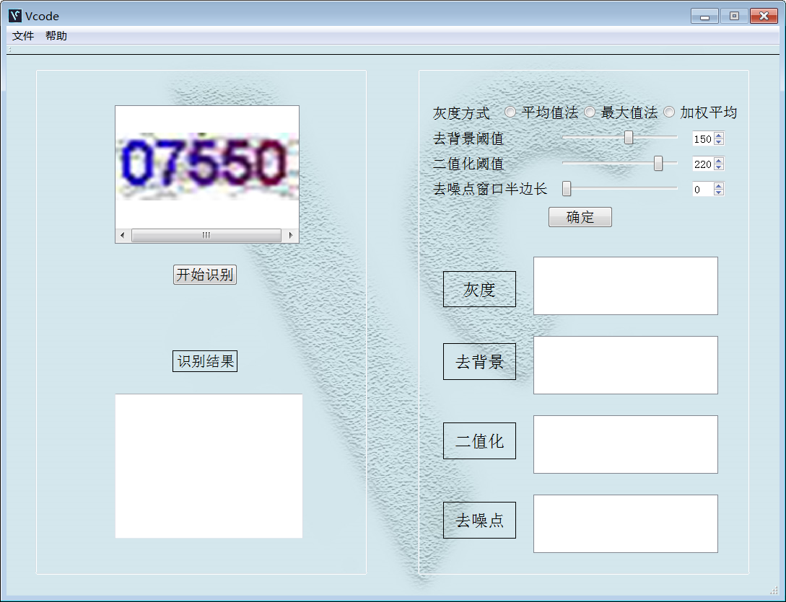
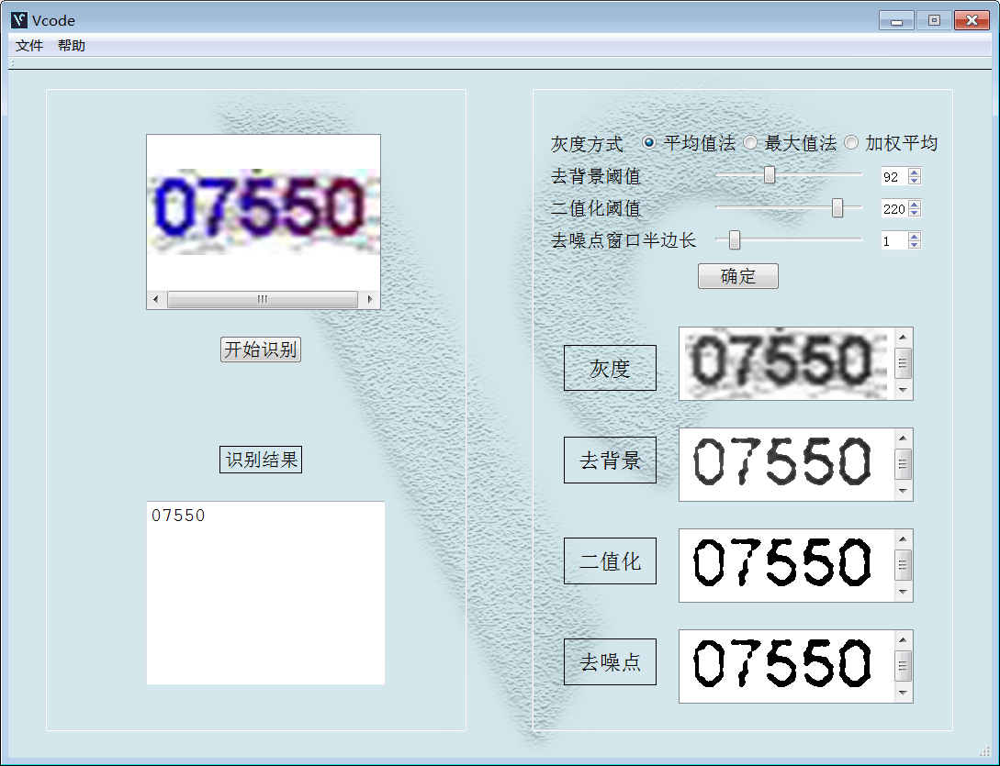
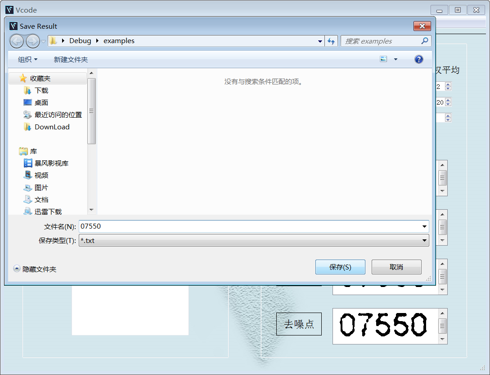
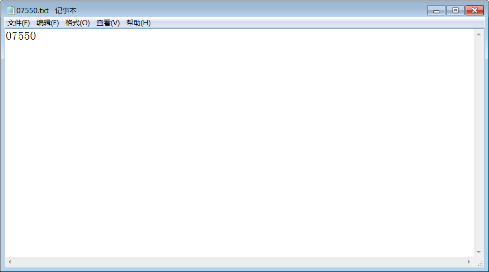

# MVVM模式下基于Tesseract的验证码识别

## 1.总体目标:

​	做一个基于tesseract的半自动的验证码识别程序。

## 2.系统需求:

​	支持用户在本地通过路径选择图片，经过去噪、去背景、二值化等图像处理，识别图片中的英文和数字。支持用户自主调节图像处理过程的参数，再进行识别。能够支持用户把识别结果保存为文档。

## 3.核心思路:

### 1) MVVM模式

- Common设计图

- Commands设计图

- Model设计图

- View设计图

- ViewModel设计图

### 2) 核心技术原理：opencv和Tesseract-OCR

* opencv

转换为灰度图：对RGB三个通道采用加权平均、取最大值、取平均值三种方式将彩色图转换为灰度图。

去背景：遍历每个像素点，当前点的灰度值大于阈值时置为白色，否则保留原值。

二值化：遍历每个像素点，当前点的灰度值大于阈值时置为白色，否则置为黑色。

去噪：使用边长为(2r+1) 的正方形，以它为元素对图像进行腐蚀、膨胀，在腐蚀的过程即可去掉小的噪点，完全消

失的噪点在膨胀时也不会出现。

* Tesseract-OCR

图片布局分析，是字符识别的准备工作。工作内容：通过一种混合的基于制表位检测的页面布局分析方法，将图像的表格、文本、图片等内容进行区分。字符分割和识别是整个Tesseract的设计目标，工作内容最为复杂。首先是字符切割，Tesseract分为两步：

利用字符间的间隔进行粗略的切分，得到大部分的字符，同时也有粘连字符或者错误切分的字符。这里会进行第一次字符识别，通过字符区域类型判定，根据判定结果对比字符库识别字符。

根据识别出来的字符，进行粘连字符的分割，同时把错误分割的字符合并，完成字符的精细切分。

由于验证码样式复杂多样，我们无法做出可以识别所有样式验证码的字库，但是可以通过机器学习来训练一定规模的样本来得到某种样式的验证码字库，通过jTessBoxEditor编辑器给训练集做label，然后运行Tesseract自带的训练指令生成样本集字库，我们测试后发现，和Tesseract自带的字库相比，自己训练的数据通常效果较好。

## 4.成果展示

* 功能1：通过路径打开图片并显示

* 功能2：用户自主选择图像处理的参数并处理

* 功能3：识别验证码

* 功能4：保存识别结果

